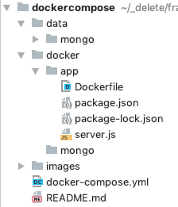
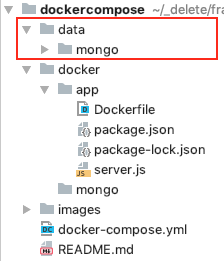
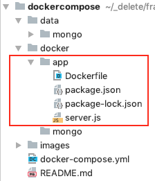
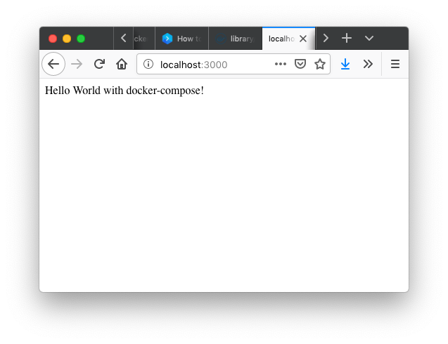
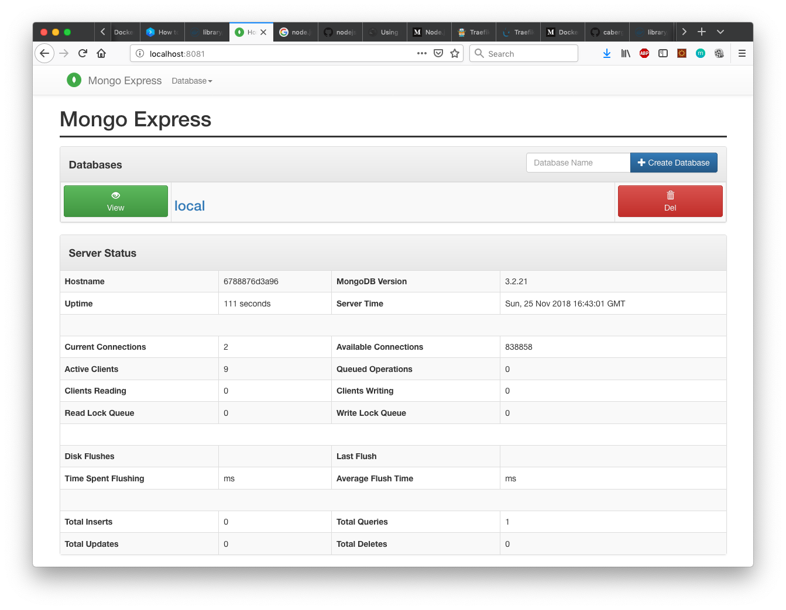
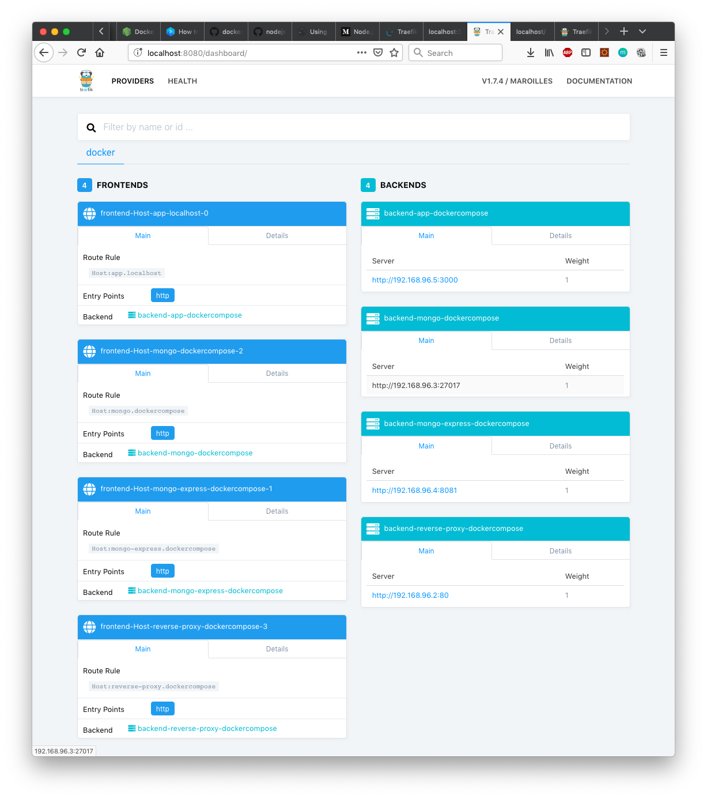
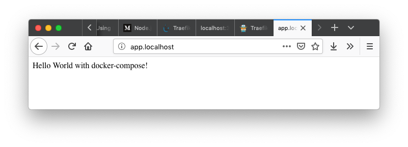

# Docker-compose for node.js/mongodb - App

This Docker-Application includes:

- a node.js-App
- a mongodb instance
- mongo-express
- traefic as reverse-proxy (<https://docs.traefik.io/>)

## How to start

Start the Containers:

```
docker-compose up --build
```

or 

```
docker-compose up --build -d
```

Stop the containers

```
docker-compose down --rmi 'local'
```

## Directory Structure 



### Data of the mongodb



### node.js - App



## Dockerfile

```docker
FROM node:8
#ENV NPM_CONFIG_LOGLEVEL info

USER node

# Create app directory
RUN mkdir -p /home/node/app
WORKDIR /home/node/app

# Install app dependencies
# A wildcard is used to ensure both package.json AND package-lock.json are copied
# where available (npm@5+)
COPY package*.json /home/node/app/

RUN npm install
# If you are building your code for production
# RUN npm install --only=production

# Bundle app source
COPY . /home/node/app/

RUN pwd
RUN ls -lah

EXPOSE 3000
CMD [ "npm", "start" ]
```

## docker-compose.yml

```yaml
version: '3'

services:
  reverse-proxy:
    #restart: always
    image: traefik:1.7 # The official Traefik docker image
    #command: --api --docker.exposedbydefault=false # Enables the web UI and tells Træfik to listen to docker, without exposing by default
    command: --api --docker #.exposedbydefault=false # Enables the web UI and tells Træfik to listen to docker, without exposing by default
    ports:
      - "80:80"     # The HTTP port
      - "8080:8080" # The Web UI (enabled by --api)
    volumes:
      - /var/run/docker.sock:/var/run/docker.sock:ro # So that Traefik can listen to the Docker events
      - ./traefik.toml:/etc/traefik/traefik.toml

  app:
    build:
      dockerfile: Dockerfile
      context: ./docker/app
    #restart: always
    user: "node"
    working_dir: /home/node/app
    ports:
      - "3000:3000"
    #volumes:
    #  - ./data/app:/home/node/app
    #command: npm start
    links:
      - mongo
    depends_on:
      - mongo
      - reverse-proxy
    labels:
      - traefik.enable=true
      - traefik.frontend.rule=Host:app.localhost

  mongo:
    image: mongo:3.2-jessie
    environment:
      # Wird die Authentifizierung verwendet, funktioniert mongo-express nicht mehr und sollte dann entfernt werden
      #MONGO_INITDB_ROOT_USERNAME: root
      #MONGO_INITDB_ROOT_PASSWORD: example
      MONGO_DATA_DIR: /data/db
      MONGO_LOG_DIR: /dev/null
    volumes:
      - ./data/mongo:/data/db
    ports:
      - "27017:27017"

  mongo-express:
    image: mongo-express:0.49.0
    environment:
      ME_CONFIG_OPTIONS_EDITORTHEME: ambiance
      ME_CONFIG_BASICAUTH_USERNAME: root
      ME_CONFIG_BASICAUTH_PASSWORD: example
    links:
      - mongo
    ports:
      - "8081:8081"
```

## Results







You have to change the `/etc/hosts`:

```
127.0.0.1	localhost
127.0.0.1	app.localhost
```




## Probleme
Leider darf man kein existierendes Verzeichnis aus dem Container als Volume an den Host binden, da dein Shodow-directory über das existierende Verzeichnis gelegt wird und daher kann auf die Daten aus diesem Verzeichnis nicht mehr zugegriffen werden.

Vgl. <https://stackoverflow.com/a/45665187>

> Your issue is the volume sharing. When you share a volume from host to the container. If the folder already exists in the container then the host container will shadow the container folder.

> If you have 10 files inside container and 0 files on your host, then after volume mapping your container will see 0 files. Because the the host folder is mounted and it has nothing. So you Dockerfile statement So your Dockerfile statement

> RUN npm install

> is effectively gone, if the host volume doesn't have the npm install done.

## Sources

- <https://nodejs.org/en/docs/guides/nodejs-docker-webapp/>
- <https://buddy.works/guides/how-dockerize-node-application>
- <https://medium.com/statuscode/dockerising-a-node-js-and-mongodb-app-d22047e2806f>
- <https://medium.com/datreeio/node-js-docker-workflow-b9d936c931e1>
- <https://blog.codeship.com/using-docker-compose-for-nodejs-development/>

### Traefik 
- <https://www.code-fabrik.com/2018/09/25/traefik-ein-reverse-proxy-f%C3%BCr-docker/>
- <https://www.tikalk.com/posts/2017/10/10/traefik-basics-with-docker-compose/>
- <https://www.smarthomebeginner.com/traefik-reverse-proxy-tutorial-for-docker/>


